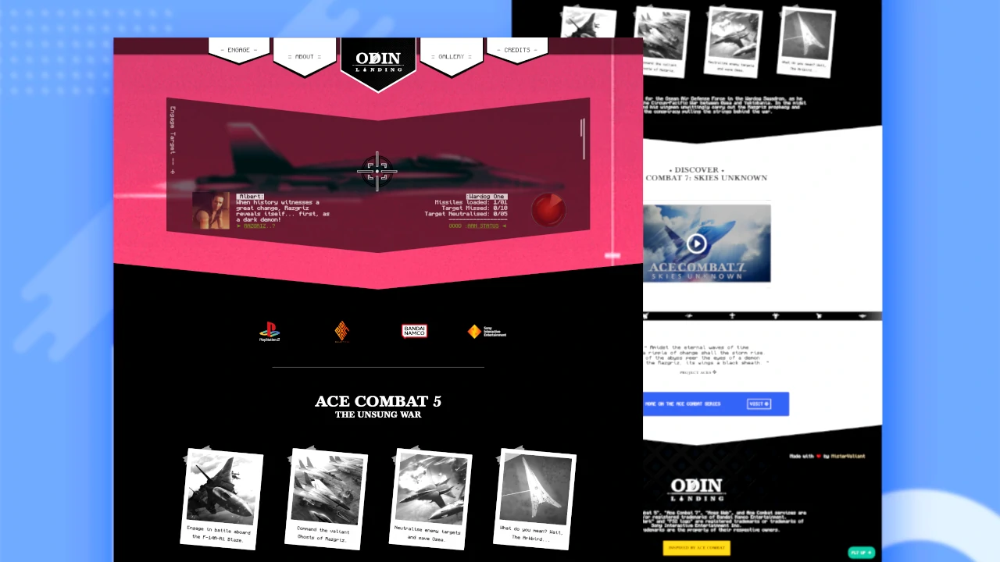

  

 

# 🛦 Odin Landing
> Odin Landing is a webpage for the popular Playstation 2 video game, Ace Combat 5: The Unsung War.

>Live demo:
[https://mistervaliant.github.io/odin-landing/](https://mistervaliant.github.io/odin-landing/ "Odin Landing")

 

>

 

## ✒️ General Information 
Wake up Wardogs! We have a target to destroy. 🚀

Odin Landing is a static website for The Odin Project (TOP) containing information on the PS2 video game, Ace Combat 5: The Unsung War.

Discover this fifth installment of the Ace Combat series. Personally, one of the coolest game I have played on the PlayStation 2 console.
 

**🛈 About Ace Combat 5:**

Ace Combat 5: The Unsung War was developed by Project Aces and released for the PlayStation 2 in 2004 by Namco. The campaign revolves around the protagonist "Blaze," a fighter pilot who commands the Wardog Squadron. The Unsung War highlights the actions of this squadron as they try to stop the enemy invasion and learn the truth about the warfare.

 

## ❤️ Motivation
The main aim of Odin Landing is to better understand how to effectively make use of Flexbox and Grid while applying all the knowledge obtained from the previous project, [Odin Recipes](https://github.com/MisterValiant/odin-recipes "Odin Recipes") in the Fullstack Web Development curriculum of The Odin Project (TOP). 

 

## 👨‍💻 Technologies Used

  

 

## 📌 Features
1. Luck-based minigame
2. Game loading screen
3. Interactive polaroids
4. Continuous image ticker

 

## 📷 Screenshots

 

## 🗺️ Room for Improvement
Issues:

1. Minigame target neutralised audio takes time to play on first successful hit
2. Hamburger navigation overlaps logo at some resolutions
3. Youtube embed logs errors in the console
4. Website takes longer to load on mobile devices
5. Clip-path not supported on all browsers (**NOTE:** Supported on all latest ones)

 

## 🔗 Acknowledgements
This project was inspired by the [Ace Combat Series](https://www.acecombat.jp "Ace Combat")

 - A game by: <a href="https://en.bandainamcoent.eu"
                        title="Bandai Namco Entertainment" target="_blank">Bandai Namco</a> and <a
                        href="https://acecombat.fandom.com/wiki/Project_Aces" title="Project Aces"
                        target="_blank">Project Aces</a>

 - Ace combat assets from: <a
                        href="https://acecombat.fandom.com/wiki/Acepedia" title='Ace Combat fandom'
                        target="_blank">Acepedia</a>
 
-  Hero GIF by: <a href="https://dribbble.com/Fugstrator"
                        title="GIF creator" target="_blank">Michael
                        Fugoso</a>
 
 - Monocraft font by: <a
                        href="https://github.com/IdreesInc/Monocraft" title="Minecraft font"
                        target="_blank">Idrees</a>

 

_Sound Effects:_

- Sound effects from <a href='https://freesound.org'>freesound.org</a>
- Target neutralised audio on <a href='https://www.youtube.com/watch?v=gN06lQ_tixU'>youtube</a>

  

 A Project for <a href='https://www.theodinproject.com/'>The Odin Project (TOP)</a> - Landing Page

 

## Contact
Created by [@MisterValiant](https://github.com/MisterValiant) - feel free to contact me! 📧